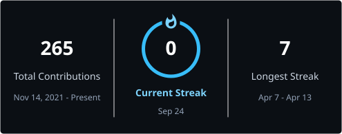

<div align="center">


  <br />


<br /><br />

  <a href="https://github.com/PauloD13">
    
  </a>


</div>

<br />

---

## 👨‍💻 Sobre mim

Sou **Paulo Demeris**, também conhecido como **P.Demeris**.

Sou **Fullstack Developer** e estudante, com **Java, TypeScript e Node.js** como principais tecnologias no meu desenvolvimento.

Também trabalho e estudo com **Python, JavaScript, AWS, Git, Bash, PowerShell e PostgreSQL**, além de outras ferramentas do ecossistema de desenvolvimento.

Meu GitHub reúne principalmente **projetos de estudo, experimentos e aplicações desenvolvidas durante meu processo de aprendizado**.

---

## 🧰 Tecnologias

### Principais

<p align="left">
  
  
  
</p>

### Também utilizo

<p align="left">
  
  
  
  
  
  
  
  
  
  
  
  
  
</p>

---

## 📂 Projetos de estudo

Projetos desenvolvidos durante meu processo de aprendizado e experimentação.

<div align="center">

<a href="https://github.com/PauloD13/WebAppliSocialViolenceGame">
  
</a>

<a href="https://github.com/PauloD13/LachoneteSystem">
  
</a>

<a href="https://github.com/PauloD13/JavaAulas">
  
</a>

</div>

---

## 💻 Ambiente

```text
P.Demeris@GitHub
├── Fullstack Development
├── Java
├── TypeScript
├── Node.js
├── Python
├── AWS
├── PostgreSQL
└── Estudo • Experimentação • Desenvolvimento
```

---

## 📊 GitHub

<div align="center">





</div>

<br />

<div align="center">



</div>

---

## 📈 Activity

<div align="center">
  
</div>

---

## GitHub Trophies

<div align="center">



</div>

---

## Contribution

<div align="center">

<picture>
  <source
    media="(prefers-color-scheme: dark)"
    srcset="https://raw.githubusercontent.com/PauloD13/PauloD13/output/github-contribution-grid-snake-dark.svg"
  />
  <source
    media="(prefers-color-scheme: light)"
    srcset="https://raw.githubusercontent.com/PauloD13/PauloD13/output/github-contribution-grid-snake.svg"
  />
  
</picture>

</div>

---

## 🌐 Redes

<div align="center">

<a href="https://github.com/PauloD13">
  
</a>

</div>

---

<div align="center">

### `P.Demeris`

<sub>Fullstack Developer • Java • TypeScript • Node.js</sub>

<br /><br />


</div>
